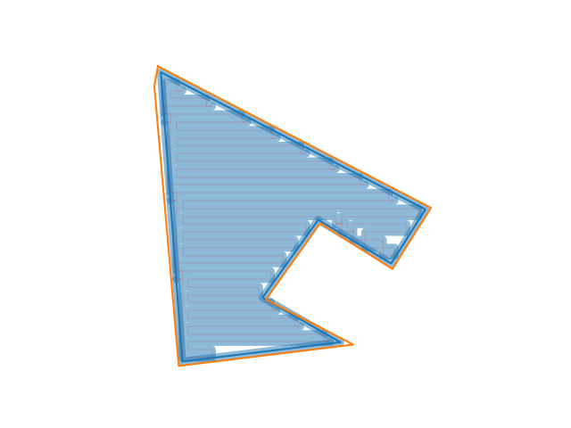

# MComp Lawn Mower Obstacle Avoidance

 Obstacle avoidance using LiDAR testing and simulation. 
 Development and testing of methods for eventual use in the automatic lawn mower. 
 To use input a perimeter, a list of nogo zones, a start point, and an end point. These points should be in GPS format as they will then be converted to UTM.
 
 UTM has been chosen as the distance the lawn mower will travel is small enough such that the curvature of the Earth is thought to have negligible affect on accuracy. UTM also provides an easy way to traverse the space in metres, using the compass on the robot.
 
# Changelog 

  * 17/02/2023: Added methods to stop the robot seeing through obstacles. The method is more relatively exhaustive but wouldn't be needed in real-life.
  * 17/02/2023: Testing with a smaller LiDAR range. Fixed getting stuck on a wall. Allowing for more direct travel.
  * 18/02/2023: Tested on coverage map generated without known obstacles.
 
# TODO 

  * [x] Handle multiple objects
      * Both close together and far apart (allowing movement between)
  * [x] Stop the robot seeing through walls
  * [ ] Handle case if point is inaccessible due to an obstacle covering, surrounding or blocking
  * [ ] Combine with route mapping - if off course and no obstacles, move back to route.

# Current Pipeline

  * Generate a perfect route with some amount of overlap, in the below case it is 25% the width of the robot
  
  
  
  * Reduce the number of points by remove those along the same line
      * This reduces the memory requirements but also reduces the chances a point is within an unknown object
	  
  
	  
  * Follow this route with unknown obstacles within
  
# Tasks

  * What level of route overlap do we need? 
  * What balance of accuracy to memory efficiency should we have?
      * More points means a higher coverage percentage, the above routes are 907 and 118 points respectively. 
      * Can we find a middle ground or should we perform multiple different routes to account for the innacuracy.
  * What else, other than RTK inaccuracy, will affect our route?
  * What is an acceptable time to compute, total route distance, and time to complete route.

# Examples

	These examples can be found in larger verisions within './Images'
	

# References

The algorithm in its current state is based primarily on the work found in:
Peng, Y., Qu, D., Zhong, Y., Xie, S., Luo, J., & Gu, J. (2015, August). The obstacle detection and obstacle avoidance algorithm based on 2-d lidar. In 2015 IEEE international conference on information and automation (pp. 1648-1653). IEEE.

Further reading has been and will continue to be conducted therefore, this section will be updated when ever the implementation draws from those sources.
