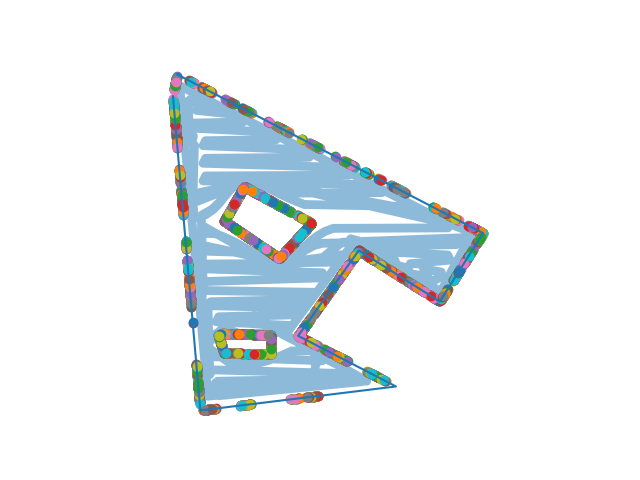
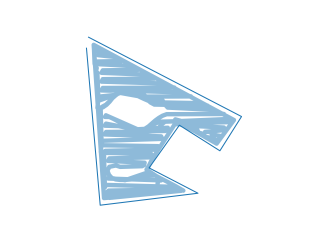

# MComp Lawn Mower Obstacle Avoidance

 Obstacle avoidance using LiDAR testing and simulation. 
 Development and testing of methods for eventual use in the automatic lawn mower. 
 To use input a perimeter, a list of nogo zones, a start point, and an end point. These points should be in GPS format as they will then be converted to UTM.
 The nogo zones and perimeter can typed literally, but the current method (and would be easier) to use a .out file created using np.savetxt.
 
 UTM has been chosen as the distance the lawn mower will travel is small enough such that the curvature of the Earth is thought to have negligible affect on accuracy. UTM also provides an easy way to traverse the space in metres, using the compass on the robot.
 
 A perimeter is needed but to test random nogos within the perimeter use the `-t` arg, followed by the number of runs. This will output the final image,
 total distance, coverage, and the number of skipped checkpoints when finished. To output printing messages the user can pass `-v`, and to output images 
 for each movement (to create GIFs similar to those shown in this README) the user can use `-p`.
 
 **Note**: Images can cause a long wait time due to the number of detected points being plotted.
 
 If the user does not wish to use GPS points for the perimeter or nogo zones then generic x, y points should be fine but the conversion to UTM needs
 to be omitted.
 
 To generate a path for the robot to follow within the given perimeter one can use my `mapping` repo. 
 
	This repo is intended to be used to learn about methods, 
	and test said methods to determine efficiency 
	and find issues before implementing on the 
	robot designed for this MCOMP project.
 
# Changelog 

	Some updates do not come with a changelog update or 
	descriptive commit, this is due to the repo being a 
	place to test, develop, and keep backups of this work. 
	Only major changes which are considered to be long 
	term or substantial will be described in this section.
	This repo is primarily for learning, testing, and 
	theoretical development, it is not necessarily 
	intended to be used in actual projects, 
	but it is hoped that this repo can at least help 
	those understand and visualise methods required for 
	path traversal and obstacle detection.
	
	
  * 17/02/2023: Added methods to stop the robot seeing through obstacles. The method is more relatively exhaustive but wouldn't be needed in real-life.
      * Testing with a smaller LiDAR range. Fixed getting stuck on a wall. Allowing for more direct travel.
  * 18/02/2023: Tested on coverage map generated without known obstacles.
  * 08/03/2023: Integrated the route traversal methods from the `Mapping` repo
      * Fixed incorrect back-on-track point
      * Removed section instructing robot to move within the line detection method
  * 09/03/2023: Fixed doubling back if off course. 
      * If the robot becomes 'off-course' but an obstacle is between it and the ideal path then it continues as normal until past the obstacle
  * 10/03/2023: Fixed issues with robot seeing through walls
      * Added method to prevent movement that results in moving through walls
      * Changed logic for determining which direction to move when an object is found
  * 11/03/2023: Added methods to produce randomly generated nogos within scene, output the shapes, and output coverage, total distance, and number of points skipped
      * Now the robot has N number of tries (relating to distance from origin) to reach a point, if this fails then A* is used along with the robot's
	  knowledge of the scene from detecting points to determine if the point is accessible or not. **Needs more testing**
          * If the point is determined inaccessible then the robot will skip this checkpoint.
  * 12/03/2023: Instead of N amount of tries, A* is used when the robot makes minimal progress within N amount of moves.

 
# TODO 

  * [x] Handle multiple objects
      * Both close together and far apart (allowing movement between)
  * [x] Stop the robot seeing through walls
  * [x] Handle case if point is inaccessible due to an obstacle covering, surrounding or blocking
  * [x] Combine with route mapping - if off course and no obstacles, move back to route.
  * [ ] Move robot to end of detected end point
  * [x] Test scenes with randomly generated nogos
  * [ ] Reduce number of detected points to minimal set
  
# Known Issues

  * If an object is flat between the target and the robot it has the chance to go back and forth without making progress
  * If the robot gets too close to an obstacle there are some issues with detecting points, this is thought to be because:
      * The 'LiDAR' comes from a single points but a real sensor would have some width
      * A real LiDAR would not need functions to find points and remove points behind walls
	  This may be fixed by changing the movement distance and bearing to keep some distance between the obstacle and the robot.
      * Currently a check has been added to determine if an object is too close or if movement results in moving within an object to adjust movement accordingly
	  It is still possible for robot to get stuck or pass through walls, but it is less common
  * A* path finding does not reliably finding a path - most often when the path would lead the robot away
  * Max tries methods have different logic and so the name and return need to be changed.
  * Printing detected points as lines appears to 'forget' earlier points

# Current Pipeline

  * Generate a 'perfect' route with some amount of overlap, in the below case it is 25% the width of the robot
  
  
  
  * Reduce the number of points by removing those along the same line
      * This reduces the memory requirements but also reduces the chances a point is within an unknown object
	  
  
	  
  * Follow this route with unknown obstacles within
  
  
  
  * Without map matching to the route this gives the following result
  
  
  
  * Applying map matching is the next step and should improve the total coverage
  
  
  * Using the robot's location and points detected from the LiDAR unknown objects can be detected
      * These points can be sent back to the server for a more optimal coverage map
      * This method could also be applied to improve the digital map's accuracy
	  
  
  
  * Applying the map matching to improve the overall coverage
  
  
  
	  When the robot is considered off course a new target point is determined.
	  This point lies on the line between the origin and current destination, 
	  initially it is the closest point on the line to the robot. However,
	  this creates problems when an obstacle is between it and this new point - 
	  the robot is most often off course when avoiding obstacles. In an attempt to 
	  avoid obstacles and move in the correct direction the new point is offset
	  by some value. It appears, the greater the value the less chance of getting stuck, 
	  but the lower total coverage.
  
  
  
	  Overall coverage can be limited to RTK accuracy, route, and unknown obstacles. 
	  These inaccuracies can be hard, or in some cases not possible due to the limitations
	  of the hardware in use. To overcome this one method is to provide more than one 
	  route. This provides more work for the robot and is in-efficient however, for 
	  an automated robot the time to finish requirement is not necessarily the primary
	  factor - though battery usage may be. In this project total coverage is the primary
	  focus and as such this is a convinient way to produce desired results.
	  
  * Using two overlapping routes to increase overall coverage 
  
  
  
  
  
# Tasks

  * What level of route overlap do we need? 
  * What balance of accuracy to memory efficiency should we have?
      * More points means a higher coverage percentage, the above routes are 907 and 118 points respectively. 
      * Can we find a middle ground or should we perform multiple different routes to account for the innacuracy.
  * What else, other than RTK inaccuracy, will affect our route?
  * What is an acceptable time to compute, total route distance, and time to complete route.
  * Testing different off course offset values.
  * A* is used to find a new path dependant on the known boundaries, when to ignore this route and skip to 
	the next checkpoint - deciding between coverage and time to find next point.

# Progress

	

# References

The algorithm in its current state is based primarily on the work found in:

Peng, Y., Qu, D., Zhong, Y., Xie, S., Luo, J., & Gu, J. (2015, August). The obstacle detection and obstacle avoidance algorithm based on 2-d lidar. In 2015 IEEE international conference on information and automation (pp. 1648-1653). IEEE.

Further reading has been and will continue to be conducted therefore, this section will be updated when ever the implementation draws from those sources.
